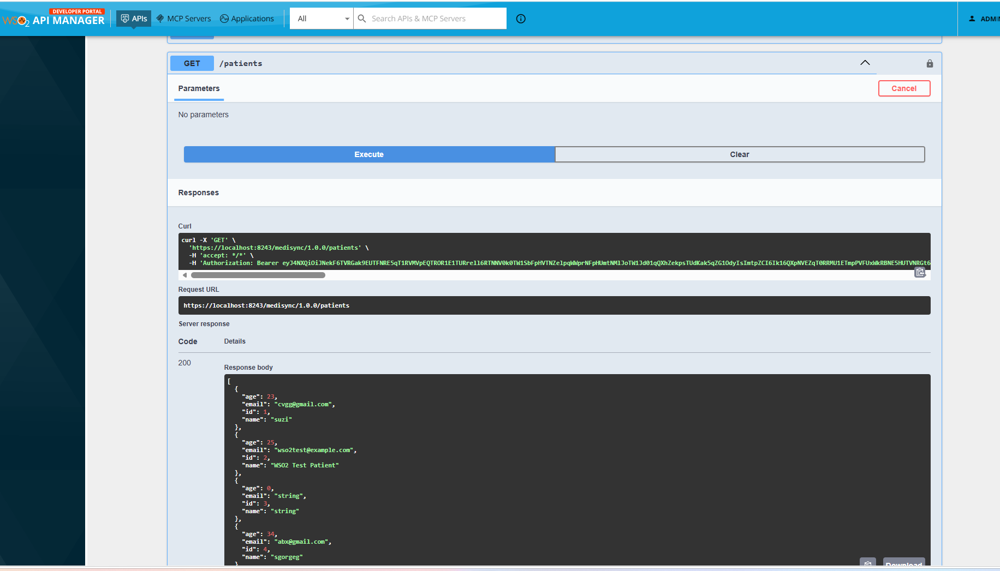
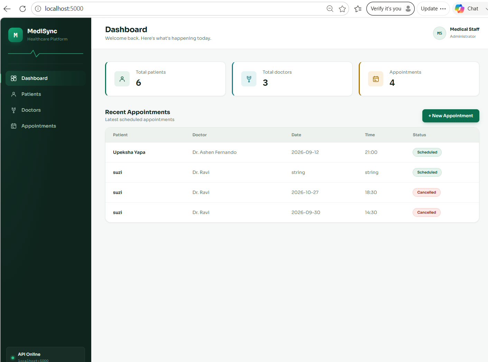
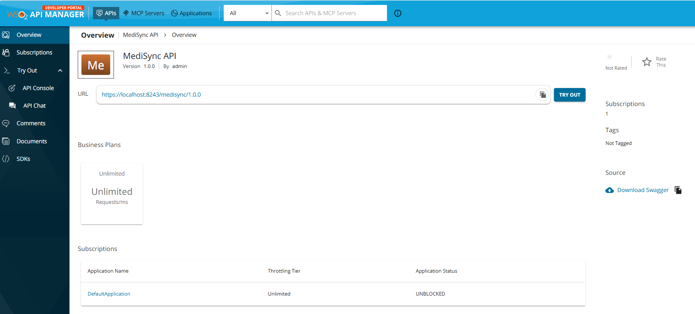
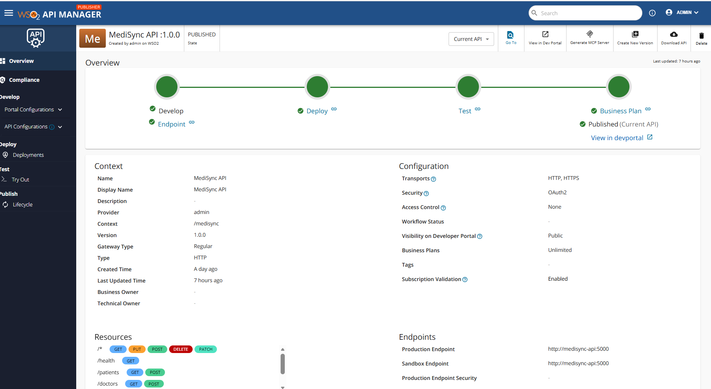

# MediSync

MediSync is a containerized healthcare management REST API built with Python, Flask, SQLAlchemy, and PostgreSQL.

The system provides APIs for managing patients, doctors, and appointments. It also demonstrates API documentation, OAuth2 security, API management, Docker containerization, database integration, testing, and DevOps practices.

The API is managed and exposed through WSO2 API Manager, while the core application remains a standard Flask-based REST backend.

## Project Overview

MediSync provides a simple healthcare backend where users can:

- Create and retrieve patients.
- Create and retrieve doctors.
- Create, retrieve, and delete appointments.
- Validate API requests.
- Store data in PostgreSQL.
- Access protected APIs using OAuth2.
- Consume APIs through an API Gateway.

The project demonstrates the complete flow from an API consumer to the API Gateway, backend service, and database.

## Key Features

### Backend

- RESTful API using Flask.
- SQLAlchemy ORM.
- PostgreSQL database.
- JSON request and response handling.
- Input validation.
- Error handling.
- Health-check endpoint.

### API Management

- OpenAPI API definition.
- API publishing and deployment.
- API lifecycle management.
- API revisions.
- API Gateway routing.
- Application subscriptions.
- OAuth2 authentication.
- API Console testing.

### DevOps

- Docker containerization.
- Docker Compose.
- Git and GitHub.
- Environment-based configuration.
- API and backend testing.
- Troubleshooting and documentation.

## System Architecture

~~~text
                         API Consumer
                              |
                              | HTTPS + OAuth2
                              v
                    +----------------------+
                    |   API Management     |
                    |      WSO2 API        |
                    |      Manager         |
                    +----------+-----------+
                               |
                               | API Gateway
                               v
                    +----------------------+
                    |    MediSync API      |
                    |       Flask          |
                    +----------+-----------+
                               |
                               | SQLAlchemy
                               v
                    +----------------------+
                    |      PostgreSQL      |
                    +----------------------+
~~~

## Request Flow

```text
Client
  |
  | HTTPS Request
  | Authorization: Bearer <OAuth2 Token>
  v
API Gateway
  |
  | Authentication / Routing
  v
Flask REST API
  |
  | SQLAlchemy
  v
PostgreSQL
  |
  v
Flask REST API
  |
  v
API Gateway
  |
  v
Client
```

## Technologies Used

| Category | Technologies |
|---|---|
| Backend | Python, Flask |
| ORM | SQLAlchemy, Flask-SQLAlchemy |
| Database | PostgreSQL |
| API | REST, JSON, OpenAPI |
| API Management | WSO2 API Manager |
| Security | OAuth2, HTTPS |
| Containers | Docker, Docker Compose |
| Version Control | Git, GitHub |
| Testing | Postman, API Console |
| Frontend | HTML, CSS |

## REST API

### API Information

| Property | Value |
|---|---|
| API Name | MediSync API |
| Version | 1.0.0 |
| Context | `/medisync` |
| Backend | Flask |
| Database | PostgreSQL |
| Format | JSON |
| Authentication | OAuth2 |
| Gateway | HTTPS |

### API Endpoints

| Method | Endpoint | Description |
|---|---|---|
| GET | `/patients` | Retrieve patients |
| POST | `/patients` | Create patient |
| GET | `/doctors` | Retrieve doctors |
| POST | `/doctors` | Create doctor |
| GET | `/appointments` | Retrieve appointments |
| POST | `/appointments` | Create appointment |
| DELETE | `/appointments/{id}` | Delete appointment |
| GET | `/health` | Backend health check |

#### Patient API

Create Patient endpoint

~~~http
POST /patients
~~~

Request

```json
{
  "name": "John Perera",
  "age": 35,
  "email": "john.perera@example.com"
}
```

Response

`201 Created`

Get Patients

~~~http
GET /patients
~~~

Response

`200 OK`

## Doctor API

### Create Doctor

~~~http
POST /doctors
~~~

Request

~~~json
{
  "name": "Dr. Silva",
  "specialization": "Cardiology"
}
~~~

Response

`201 Created`

## Database

PostgreSQL is used as the primary database.

The main entities are:

- Patients
- Doctors
- Appointments

The appointment entity references both a patient and a doctor.

~~~text
Patient
   |
   | patient_id
   v
Appointment
   ^
   | doctor_id
   |
Doctor
~~~

SQLAlchemy is used as the ORM layer between Flask and PostgreSQL.

## Docker

The application is containerized using Docker.

Docker Compose manages the backend and PostgreSQL services.

~~~text
+-----------------------------+
|       Docker Compose        |
+--------------+--------------+
               |
       +-------+-------+
       |               |
       v               v
+-------------+   +-------------+
| Flask API   |   | PostgreSQL  |
| Port 5000   |   | Port 5432   |
+-------------+   +-------------+
~~~

## Running the Project

### Prerequisites

- Git
- Docker
- Docker Compose

### Clone Repository

~~~bash
git clone https://github.com/Zaffraj-Suzanee/medisync.git
cd medisync
~~~

### Start the Application

~~~bash
docker compose up --build
~~~

Or run in the background:

~~~bash
docker compose up -d --build
~~~

### Check Containers

~~~bash
docker ps
~~~

### Test Backend

~~~bash
curl http://localhost:5000/health
~~~

Expected:

~~~json
{
  "status": "healthy"
}
~~~

### Stop Containers

~~~bash
docker compose down
~~~

## API Management

The MediSync API is managed through WSO2 API Manager, which provides the API Gateway, security, subscription management, access control, rate limiting, and API lifecycle management.

WSO2 is used as the API management layer while the core application remains a Flask-based REST backend.

### WSO2 API Management Features

- API creation and OpenAPI definition
- API publishing and lifecycle management
- API revisions and deployment
- API Gateway routing
- OAuth2 authentication
- Application subscriptions
- Operation-level API scopes
- Rate limiting
- API Console testing

### WSO2 API Configuration

| Property | Configuration |
|---|---|
| API Name | MediSync API |
| Version | 1.0.0 |
| Context | `/medisync` |
| Lifecycle | PUBLISHED |
| Rate Limiting | 10KperMin |
| Security | OAuth2 |
| Subscription | Unlimited |
| Application | DefaultApplication |
| Application Status | UNBLOCKED |
| Operation scope | appointments:delete |

#### Operation-Level Scope

The appointments:delete scope is configured for the:
```bash
DELETE /appointments/{id}
```
operation.

This provides fine-grained access control for appointment deletion.

#### Rate Limiting

The 10KPerMin rate-limiting policy is configured for the:
```bash
DELETE /appointments/{id}
```
operation.

This controls the number of requests allowed within the configured time period and helps protect the backend from excessive API traffic.

#### API Gateway

Requests are routed through the WSO2 API Gateway before reaching the Flask backend:

```text
API Consumer
     |
     | HTTPS + OAuth2
     v
WSO2 API Gateway
     |
     | Scope / Rate Limiting / Routing
     v
Flask REST API
     |
     v
PostgreSQL
```

#### API Revision

API configuration changes are deployed using WSO2 API revisions. The API remains publicly available as version 1.0.0 while revisions are used to manage configuration changes and deployments.

#### Gateway

~~~text
https://localhost:8243/medisync/1.0.0
~~~

#### Developer Portal

~~~text
https://localhost:9443/devportal/
~~~

## OAuth2 Security

Protected API operations use OAuth2 authentication.

The general request format is:

~~~http
Authorization: Bearer <ACCESS_TOKEN>
~~~

The OAuth2 token is generated through the API management application and used to access protected API operations.

Secrets and access tokens must never be committed to the repository.

## OpenAPI

The MediSync API is documented using OpenAPI.

The API definition includes:

- Endpoints.
- HTTP methods.
- Request bodies.
- JSON schemas.
- Required fields.
- Response codes.
- Security configuration.

For example, POST operations define JSON request bodies using:

~~~yaml
requestBody:
  required: true
  content:
    application/json:
      schema:
        type: object
~~~

This allows API clients and the API Console to correctly understand POST requests.

## API Lifecycle

~~~text
Create API
    |
    v
Define API
    |
    v
Deploy
    |
    v
Publish
    |
    v
Subscribe Application
    |
    v
Generate OAuth2 Token
    |
    v
Consume API
~~~

### API Revision

During development, the OpenAPI definition was updated to correctly define JSON request bodies for POST operations.

The updated configuration was deployed using **Revision 2**.

The public API version remained:

~~~text
1.0.0
~~~

This demonstrates the difference between an API revision and an API version.

## Testing

The system was tested at several levels:

- Backend API testing.
- Database integration testing.
- API Gateway testing.
- OAuth2 authentication testing.
- OpenAPI validation.
- Positive API testing.
- Negative API testing.

## Screenshots

<p align="center">
  
  
  
  
</p>

## Troubleshooting

### Docker Issues

Check running containers:

~~~bash
docker ps
~~~

View logs:

~~~bash
docker compose logs
~~~

Restart:

~~~bash
docker compose up -d
~~~

## Conclusion

MediSync demonstrates the development of a practical healthcare REST API from backend implementation to database integration, containerization, API security, API management, and testing.

The project combines commonly used technologies such as Python, Flask, PostgreSQL, Docker, Git, REST APIs, OpenAPI, and OAuth2, with WSO2 API Manager used as the API management and gateway layer.

The architecture provides a strong foundation for future improvements such as CI/CD, Kubernetes, cloud deployment, monitoring, authentication, and advanced API management.

